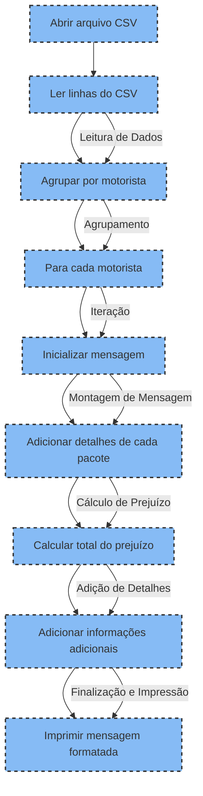

## Gerador de mensagens personalizadas

O código Python lê dados de um arquivo CSV que contém informações sobre descontos relacionados a entregas afetadas durante o transporte. Ele agrupa essas informações por motorista e gera mensagens personalizadas para cada um. Cada mensagem informa ao motorista sobre a necessidade de aplicar descontos em futuros fretes devido aos eventos ocorridos. As mensagens incluem detalhes específicos de cada entrega afetada, como número de rastreamento (SPX TRACKING NUMBER), data de coleta, e o valor do prejuízo. Além disso, calcula o total do prejuízo para cada motorista e inclui instruções sobre como será aplicado o desconto e quais as ações a serem tomadas caso haja dificuldades no pagamento dos descontos.

### Fluxo de Processamento dos Dados

### Configuração e Execução
 Configuração e Execução
Para garantir que o projeto execute corretamente na sua máquina ou na máquina do avaliador, siga estas etapas:

## Clone o Repositório:
bash
git clone https://github.com/HerbertSouto/gerador_de_mensagem.git
cd gerador_de_mensagem

## Instale o Poetry:
Certifique-se de ter Poetry instalado. Para instalar, siga as instruções em Poetry Installation Guide.

## Use Poetry para instalar as dependências do projeto:
bash
poetry install

## Ative o ambiente virtual do Poetry:
para garantir que todas as dependências estejam disponíveis.

bash
poetry shell

## Execute o Projeto:
bash
python app/main.py

## Contribuição
Contribuições são bem-vindas! Sinta-se à vontade para abrir um Pull Request para melhorias ou correções no projeto.
